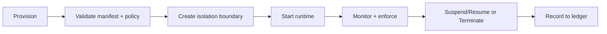

# Agent Lifecycle

OctantOS treats agents as managed operating-system workloads with explicit lifecycle control.

## Lifecycle States

1. Provisioned
2. Validated
3. Isolated
4. Running
5. Suspended or throttled
6. Terminated
7. Archived (audit + artifacts)

## Lifecycle Flow

## Isolation and Communication

- Agents run in constrained execution contexts.
- Inter-agent communication is mediated through controlled service interfaces.
- Resource and syscall boundaries remain enforced throughout execution.

## End-of-Life Guarantees

- Runtime teardown removes active execution context.
- Access tokens and ephemeral state are revoked.
- Final lifecycle events are committed to audit records.
