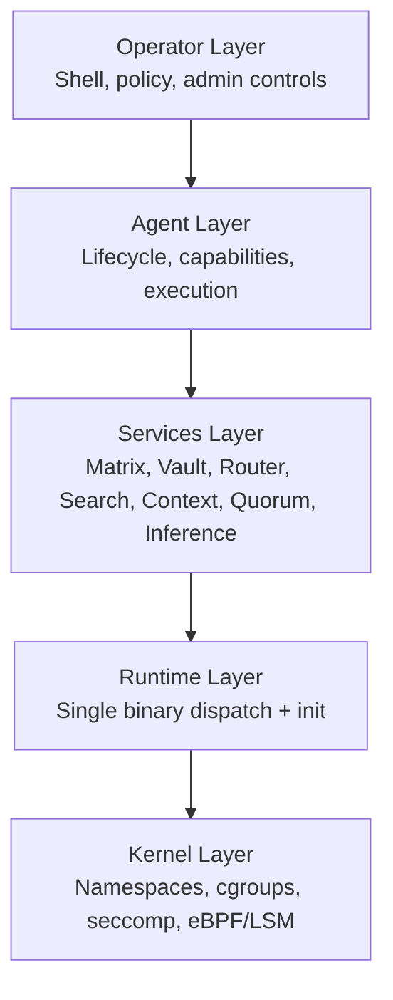

# Architecture Overview

OctantOS is structured as a layered system where each layer has a clear responsibility and a hard boundary.

## Layer Model



## Crate Map (Names Only)

- `octant-bin` - multicall entrypoint and dispatch
- `octant-agent` - agent runtime and orchestration
- `octant-manifest` - capability parsing and validation
- `octant-isolation` - namespace/cgroup/seccomp setup
- `octant-vault` - encrypted credential management
- `octant-router` - multi-provider LLM routing
- `octant-search` - metasearch and indexing infrastructure
- `octant-context` - layered memory and retrieval
- `octant-ledger` - append-only action logging and verification
- `octant-compute` - isolated compute orchestration

## Filesystem Shape (Public View)

```text
/octant                 # single static binary
/etc/octant/            # configuration and policy
/var/lib/octant/        # state, ledger, indices, manifests
/var/log/octant/        # operational logs
/opt/octant/skills/     # installed skill artifacts and metadata
```

## Design Priorities

1. Deterministic startup and operational behavior
2. Security boundaries enforced below application logic
3. Capability-constrained autonomy for agents
4. Auditable operations suitable for production governance
